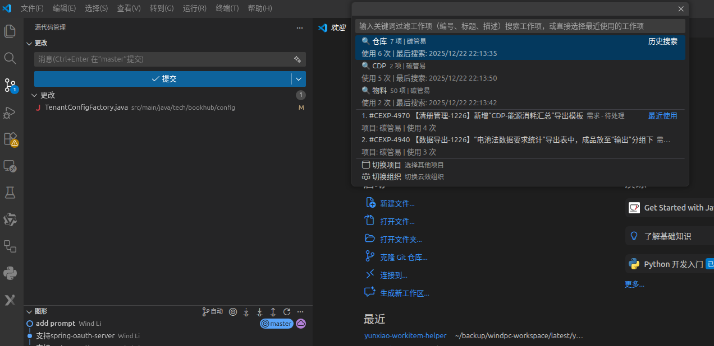
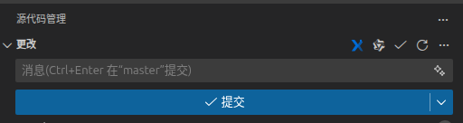

# 云效工作项助手

将阿里云效（Alibaba Cloud DevOps）深度集成到 VSCode 中，为开发者提供一站式项目管理体验。不仅支持工作项管理、AI助手集成、Git提交关联，还提供完整的代码仓库浏览、分支管理与一键签出功能，让您的开发流程更加高效。

## 功能特性

### 📋 项目与工作项管理
- 浏览云效项目列表
- 查看项目下的所有工作项（需求、任务、缺陷等）
- 支持搜索和筛选工作项

### 📊 工作项详情查看
- 📄 **属性面板**：右键工作项查看完整信息
- 💬 **评论显示**：查看工作项的所有评论，支持富文本和置顶标识
- 🔍 **详细信息**：一键查看 JSON 格式的完整数据
- 🎨 **富文本支持**：正确显示描述和评论中的图片、列表、代码等
- 📱 **现代化界面**：左右分栏布局，右侧操作面板

### ✨ 工作项状态可视化
- 🔵 **蓝色勾选图标**：已粘贴到提交记录，待提交
- 🟢 **绿色验证图标**：已发送到AI，工作中
- 🔹 **默认图标**：尚未操作
- 👁️ **鼠标悬停**：显示完整工作项信息和使用状态
- 📊 **状态跟踪**：自动记录和展示工作项的操作历史

### 📝 快速粘贴提交消息
- 一键粘贴工作项到 Git 提交消息框
- 自动格式化为 `#工作项编号 工作项标题`
- 支持多种粘贴目标：提交消息框、光标位置、剪贴板
- 可自定义粘贴格式模板

### 🌿 Git分支集成
- 🆕 **一键创建分支**：基于工作项自动创建并切换分支
- 🏷️ **灵活命名**：支持变量模板 `{category}_{id}_{title}`
- 🔒 **安全切换**：自动检测未提交修改，提供暂存/提交/放弃选项
- ⚙️ **智能处理**：分支已存在时智能判断，防止数据丢失

### 📦 代码仓库管理
- 📁 **仓库浏览**：查看组织下的所有代码仓库
- 🌳 **分支管理**：浏览仓库的所有分支，支持收藏
- ⬇️ **一键签出**：通过 SSH 协议克隆仓库或指定分支
- 🔀 **合并请求**：从分支直接创建合并请求
- ⭐ **收藏功能**：收藏常用仓库和分支
- 🕒 **最近使用**：记录最近访问的仓库和分支

### ⏱️ 最近使用
- 记录最近访问的项目和工作项
- 智能排序，提升工作效率

### 🤖 AI 助手集成
- 支持发送工作项到多种 AI 助手:Qoder、GitHub Copilot、通义灵码、TRAE AI、自定义 AI
- 一键发送,自动附加文件或复制到剪贴板
- 自定义消息模板,支持多种变量
- 首次使用智能引导,快速配置
- 🌟 **Qoder 特别支持**：在 Qoder 开发工具中，未配置默认 AI 时自动使用 Qoder AI

### 🌐 浏览器集成
- 快速在浏览器中打开工作项详情
- 一键跳转到项目看板

## 安装

1. 在 VSCode 扩展市场搜索"云效工作项助手" [云效工作项助手](https://marketplace.visualstudio.com/items?itemName=WindLi.yunxiao-workitem-helper)
2. 点击安装
3. 重启 VSCode
## 截屏

## 快速开始
---

### 个人访问令牌登录

1. 点击状态栏的“云效: 未登录”
2. 或使用命令面板（`Ctrl+Shift+P`）执行“云效：登录”，自动打开浏览器打开 https://devops.aliyun.com/organization/ ，登录之后可以看到url里包含 orgId
3. 如果首次登录，会提示输入组织 ID（例如：`66a0326c1d2a2a350e263a7d`）
4. 输入个人访问令牌  
    4.1. 自动打开，访问并登录 https://account-devops.aliyun.com/settings/personalAccessToken  
    4.2. 点击“新建访问令牌”  
    4.3. 填写名称、描述、有效期  
    4.4. 选择权限：组织（用户只读），项目（项目只读、工作项管理只读），**代码管理（代码库只读、分支只读）**  
    4.5. 保存生成的令牌
5. 登录成功后状态栏显示用户名

🔑 **管理组织 ID**：使用 `云效：管理组织 ID` 命令可查看、修改或删除组织 ID。

### 代码仓库管理

在侧边栏的“云效代码”按钮中，可以：

1. **浏览仓库**：查看所有代码仓库，支持收藏常用仓库
2. **查看分支**：点击仓库查看其所有分支
3. **签出仓库**：右键仓库 → “签出仓库”，克隆默认分支
4. **签出分支**：右键分支 → “签出分支”，克隆指定分支
5. **创建合并请求**：右键分支 → “创建合并请求”

> 📝 **注意**：签出功能使用 SSH 协议，请确保已配置好 SSH 密钥。

### 源代码管理，云效快速搜索粘贴
快速搜索选择工作项并粘贴到提交消息的开头

### 云效工作项
工具栏左侧，云效工作项面板包含全部功能。可以浏览项目和工作项，使用历史。可以快速复制、打开、插入到提交记录。
### 使用工作项

1. 执行命令"云效：选择项目"（`Ctrl+Shift+Y P`）
2. 选择你的项目
3. 执行命令"云效：选择工作项"（`Ctrl+Shift+Y W`）
4. 选择工作项，自动粘贴到提交消息框

## 快捷键

| 快捷键 | 功能 |
|--------|------|
| `Ctrl+Shift+Y P` | 选择项目 |
| `Ctrl+Shift+Y C` | 粘贴到提交消息 |
| `Ctrl+Shift+Y R` | 刷新工作项列表 |

*Mac 用户请将 `Ctrl` 替换为 `Cmd`*

## 配置选项

### 认证配置

| 配置项 | 说明 | 默认值 |
|--------|------|--------|
| `yunxiao.domain` | 云效 API 服务域名 | "openapi-rdc.aliyuncs.com" |

🔒 **组织 ID 已加密存储**：使用 `云效：管理组织 ID` 命令管理。

### 界面配置

| 配置项 | 说明 | 默认值 |
|--------|------|--------|
| `yunxiao.pasteTarget` | 粘贴目标位置 | "commit" |
| `yunxiao.pasteTemplate` | 粘贴格式模板 | "#{id} {type} {title}" |
| `yunxiao.includeTypeLabel` | 包含工作项类型标签 | false |
| `yunxiao.includeStatus` | 包含工作项状态 | false |
| `yunxiao.includeLink` | 包含工作项链接 | false |

### 缓存配置

| 配置项 | 说明 | 默认值 |
|--------|------|--------|
| `yunxiao.projectCacheDuration` | 项目列表缓存时长（分钟） | 30 |
| `yunxiao.workitemCacheDuration` | 工作项列表缓存时长（分钟） | 10 |

### 其他配置

| 配置项 | 说明 | 默认值 |
|--------|------|--------|
| `yunxiao.customAI.defaultAI` | 默认 AI 助手 | "" (首次使用显示引导) |
| `yunxiao.tongyiTemplate` | 发送到通义灵码的消息模板 | "{type} #{id} {title}\n{description}" |
| `yunxiao.copilotTemplate` | 发送到 Copilot 的消息模板 | "{type} #{id} {title}\n{description}" |
| `yunxiao.traeTemplate` | 发送到 TRAE AI 的消息模板 | "{type} #{id} {title}\n{description}" |
| `yunxiao.branchNameTemplate` | 分支命名模板 | "{category}_{id}" |
| `yunxiao.maxRecentProjects` | 最近使用项目数量上限 | 20 |
| `yunxiao.maxRecentWorkItems` | 最近使用工作项数量上限 | 50 |

## AI 助手集成

本扩展支持将工作项信息发送到多种 AI 助手,方便您向 AI 咨询关于工作项的问题。

### 🌟 Qoder 特别支持

在 **Qoder 开发工具**中使用本扩展时：

- ✅ **自动识别环境**：无需配置，自动检测当前运行在 Qoder 中
- ✅ **默认 AI 为 Qoder**：未配置 `defaultAI` 时，自动使用 Qoder AI
- ✅ **无缝集成**：右键工作项 → “发送到 AI 助手”，直接发送到 Qoder
- ✅ **专属菜单**：只在 Qoder 中显示“发送到 Qoder”菜单

> 💡 **提示**：在其他 IDE（如 VSCode）中，首次使用会显示引导，选择您喜欢的 AI 助手。

### 快速开始

#### 1️⃣ 首次使用

**在 Qoder 中**：
1. 在工作项上右键，选择 **“发送到 AI 助手”** 或 **“发送到 Qoder”**
2. 自动发送到 Qoder AI，无需额外配置 ✨

**在其他 IDE 中**：
1. 在工作项上右键，选择 **"发送到 AI 助手"**
2. 首次使用会显示引导对话框，选择您喜欢的 AI：
   - **Qoder** - 内置 AI，自动附加文件（推荐）
   - **GitHub Copilot** - 自动附加文件，直接提问
   - **通义灵码** - 复制粘贴模式
   - **TRAE AI** - 自动附加文件，直接提问
   - **自定义 AI** - 配置其他 AI 工具
3. 选择后自动保存配置，下次直接使用

#### 2️⃣ 使用功能

在工作项上右键，选择：
- **发送到 AI 助手** - 使用默认配置的 AI（Qoder 环境下默认为 Qoder）
- **发送到 Qoder** - 固定使用 Qoder（仅在 Qoder 中显示）
- **发送到 GitHub Copilot** - 固定使用 Copilot
- **发送到通义灵码** - 固定使用通义
- **发送到 TRAE AI** - 固定使用 TRAE

#### 3️⃣ 完成!

- **Qoder**: 文件会自动附加，直接提问即可 ✨
- **Copilot**: 文件会自动附加，直接提问即可 ✨
- **TRAE**: 文件会自动附加，直接提问即可 ✨
- **通义**: 手动粘贴(`Ctrl+V`)到聊天框

### 工作流程

#### 使用 Qoder

1. 右键工作项 → **“发送到 Qoder”** 或 **“发送到 AI 助手”**
2. 工作项信息会：
   - 自动创建文件到 `.yunxiao/{Bug|Req|Task}/{id}_{title}.txt`
   - 附加到 Qoder Chat
   - 打开 Qoder 聊天面板
3. 直接在 Qoder 中提问：
   - “这个问题可能的原因是什么？”
   - “给出解决方案”
   - “写一个修复这个 Bug 的测试用例”

#### 使用 GitHub Copilot

1. 右键工作项 → **"发送到 GitHub Copilot"**
2. 工作项信息会:
   - 自动创建文件到 `.yunxiao/{Bug|Req|Task}/{id}_{title}.txt`
   - 附加到 Copilot Chat
   - 打开 Copilot 聊天面板
3. 直接在 Copilot 中提问:
   - "这个问题可能的原因是什么?"
   - "给出解决方案"
   - "写一个修复这个 Bug 的测试用例"

#### 使用 TRAE AI

1. 右键工作项 → **"发送到 TRAE AI"**
2. 工作项信息会:
   - 自动创建文件到 `.yunxiao/{Bug|Req|Task}/{id}_{title}.txt`
   - 附加到 TRAE Chat
   - 打开 TRAE AI 聊天面板
3. 直接在 TRAE 中提问:
   - "分析这个需求的技术实现方案"
   - "这个 Bug 可能的原因是什么?"
   - "生成单元测试代码"

#### 使用通义灵码

1. 右键工作项 → **"发送到通义灵码"**
2. 工作项信息自动复制到剪贴板
3. 打开通义灵码聊天面板
4. 在输入框按 `Ctrl+V` 粘贴并发送

> 💡 **技术说明**:由于通义灵码暂未提供公开的 API,目前需要手动粘贴。

### 配置说明

#### 修改默认 AI

在 VSCode 设置中搜索 `yunxiao.customAI.defaultAI`:

```json
{
  "yunxiao.customAI.defaultAI": "qoder"  // 可选: qoder, copilot, tongyi, trae, custom
}
```

#### 自定义消息模板

**Copilot 模板**:
```json
{
  "yunxiao.copilotTemplate": "请帮我分析:\n\n{type} #{id} {title}\n\n{description}"
}
```

**通义模板**:
```json
{
  "yunxiao.tongyiTemplate": "{type} #{id} {title}\n\n详细描述:\n{description}"
}
```

**TRAE 模板**:
```json
{
  "yunxiao.traeTemplate": "{type} #{id} {title}\n\n详细描述:\n{description}"
}
```

**支持的变量**:
- `{type}` - 工作项类型
- `{id}` - 工作项编号
- `{title}` - 标题
- `{description}` - 描述
- `{status}` - 状态
- `{assignee}` - 指派人
- `{priority}` - 优先级

#### 自定义 AI 配置(高级)

如果您想使用其他 AI 工具(如 Claude、Cursor 等):

```json
{
  "yunxiao.customAI.defaultAI": "custom",
  "yunxiao.customAI.extensionId": "Your.AI.Extension",  // 扩展 ID
  "yunxiao.customAI.extensionName": "Your AI Name",  // 显示名称
  "yunxiao.customAI.openCommand": "yourAI.openChat",  // 打开聊天命令
  "yunxiao.customAI.attachCommand": "",  // 附加选择命令(可选)
  "yunxiao.customAI.installUrl": "vscode:extension/Your.AI.Extension",  // 安装 URL
  "yunxiao.customAI.template": "{type} #{id} {title}\n{description}"  // 消息模板
}
```

### 文件管理

使用支持附加的 AI(如 Copilot)时,文件保存在:

```
工作区/
└── .yunxiao/
    ├── Bug/         # 缺陷
    ├── Req/         # 需求
    └── Task/        # 任务
```

**文件命名规则**:
- 格式: `{id}_{title前60字符}.txt`
- 示例: `TEST-123_修复登录问题.txt`
- 重名自动递增: `TEST-123_修复登录问题(1).txt`

### 常见问题

#### Q: 如何找到扩展的命令 ID?

**A**: 有几种方法:
1. 查看扩展的 `package.json` 文件中的 `contributes.commands`
2. 按 `F1` 输入 `Developer: Show All Commands`,搜索命令并查看详情
3. 参考扩展的文档或 README

#### Q: 自定义 AI 不支持 attachSelection 会怎样?

**A**: 如果 `attachCommand` 为空:
- 不会创建文件
- 直接复制到剪贴板
- 打开聊天面板
- 提示用户手动粘贴

#### Q: 文件会自动清理吗?

**A**: 当前版本不会自动清理。建议:
- 定期手动清理 `.yunxiao` 目录
- 或保留有用的文件作为历史记录

### 前置条件

- **Qoder**: 内置支持，无需额外安装
- **GitHub Copilot**: [GitHub Copilot](vscode:extension/GitHub.copilot-chat)
- **通义灵码**: [Tongyi Lingma](vscode:extension/Alibaba-Cloud.tongyi-lingma)
- **TRAE AI**: [TRAE AI](vscode:extension/MarsCode.marscode-extension)

如果未安装，扩展会提示您前往安装。

## 粘贴格式模板

粘贴格式模板支持以下变量：

- `{id}` - 工作项编号
- `{title}` - 工作项标题
- `{description}` - 工作项描述
- `{type}` - 工作项类型
- `{catetory}` - 工作项类型:Req,Bug...
- `{status}` - 工作项状态

示例模板：

```
#{id} {type} {title}
```

输出：
```
#TEST-123 需求 实现用户登录功能
```

带类型标签的模板：
```
[{type}]#{id} {title}
```

输出：
```
[需求]#TEST-123 实现用户登录功能
```

## 常见问题

### Q: 如何获取组织 ID？

A: 
1. 登录云效后，在浏览器地址栏查看 URL：`https://devops.aliyun.com/organization/`
2. 或联系组织管理员获取
3. 首次登录时会自动提示输入
4. 使用 `云效：管理组织 ID` 命令可查看、修改或删除

ℹ️ **安全性**：组织 ID 已加密存储，不会显示在配置文件中。

### Q: PAT 令牌需要哪些权限？

A: 至少需要以下权限：
- 组织用户: 读取权限
- 项目管理：读取权限
- 工作项管理：读取权限
- **代码管理**：代码库只读、分支只读（如需使用代码仓库功能）

### Q: 如何刷新项目和工作项列表？

A: 使用快捷键 `Ctrl+Shift+Y R` 或执行命令"云效：刷新"清除缓存，下次访问会重新加载。

### Q: 粘贴后提交消息框没有内容？

A: 请确保：
1. 已经初始化 Git 仓库
2. VSCode 的源代码管理面板已打开
3. 配置中的粘贴目标设置为"commit"

### Q: 为什么不能自动发送到通义灵码?

A: 由于以下技术限制:
1. 通义灵码暂未提供公开的 API 供其他扩展调用
2. VSCode 扩展之间存在 WebView 隔离,无法直接操作彼此的界面元素
3. 出于安全考虑,VSCode 不允许跨扩展直接操作 DOM

目前的复制到剪贴板方案是最稳定可靠的实现。我们会持续关注通义灵码的更新,一旦有相关 API 支持,将立即优化为自动发送功能!

### Q: 如何配置 SSH 密钥以使用签出功能？

A: 签出功能使用 SSH 协议，需要配置 SSH 密钥：
1. 生成 SSH 密钥：`ssh-keygen -t rsa -b 4096 -C "your_email@example.com"`
2. 查看公钥：`cat ~/.ssh/id_rsa.pub`
3. 在云效中添加 SSH 公钥：
   - 访问 https://devops.aliyun.com/settings/sshKey
   - 点击“添加 SSH 公钥”
   - 粘贴公钥内容并保存
4. 测试连接：`ssh -T git@codeup.aliyun.com`

### Q: 签出到哪里？

A: 签出位置由工作区状态决定：
- **未打开项目**：让您选择签出位置，签出后自动打开
- **单个项目**：默认在项目主目录下签出，不会弹出提示
- **多个项目**：让您选择在哪个项目下签出

系统会自动检测目录是否已存在，防止覆盖现有文件。

### Q: 支持哪些工作项类型?

A: 支持云效中的所有工作项类型,包括:
- 需求(Req)
- 任务(Task)
- 缺陷(Bug)
- 风险(Risk)
- 子任务(SubTask)
- 以及组织自定义的工作项类型

### Q: 如何自定义分支名称?

A: 在设置中配置 `yunxiao.branchNameTemplate`，支持以下变量：
- `{category}` - 工作项类型（Req、Bug、Task等）
- `{id}` - 工作项标识符（如 TEST-123）
- `{title}` - 工作项标题（经过清理，移除非法字符）
- `{date}` - 当前日期（YYYYMMDD格式）

示例模板：
- `{category}_{id}` → `Bug_TEST-123`
- `{category}_{id}_{title}` → `Req_TEST-456_用户登录`
- `feature/{id}_{date}` → `feature/TEST-789_20251223`

### Q: 创建分支时有未提交修改怎么办?

A: 系统会自动检测，并提供安全选项：
1. **暂存并切换**：自动执行 `git stash`，切换后可使用 `git stash pop` 恢复
2. **提交并切换**：引导您先提交当前修改
3. **放弃修改并切换**：强制清理修改（需二次确认）
4. **取消**：保持当前状态

默认选项为“取消”，优先保护您的代码安全。

## 版本历史

### 1.5.0 (2025-12-24)

- 📦 **代码仓库管理**
  - 📁 浏览组织下的所有代码仓库
  - 🌳 查看仓库的所有分支
  - ⬇️ **一键签出**：通过 SSH 协议克隆仓库或指定分支
  - 🔀 从分支直接创建合并请求
  - ⭐ 收藏常用仓库和分支
  - 🕒 记录最近访问的仓库和分支
- 🔧 **签出功能优化**
  - 智能判断签出位置（工作区内/外）
  - 签出到工作区内时不弹出提示
  - 支持直接克隆指定分支

### 1.4.7 (2025-12-24)

- ✨ 工作项详情增强
  - 📝 **评论显示**：在工作项属性面板中查看所有评论
  - 📋 **详细信息(JSON)**：一键查看完整的工作项原始数据
  - 🎨 **评论样式优化**：置顶评论高亮显示，支持富文本内容
  - 📄 **右侧操作面板**：操作按钮移至右侧竖向显示，布局更清晰

### 1.4.0 (2025-12-24)

- ✨ 工作项状态可视化
  - 🟢 绿色图标：已发AI，工作中
  - ⬛ 蓝色图标：已提交，已完成
  - 👁️ 鼠标悬停显示完整状态信息
- 🌿 Git分支集成
  - 🆕 一键创建并切换分支
  - 🏷️ 灵活的分支命名模板
  - 🔒 安全的分支切换机制
- 📊 状态持久化存储
- 📄 工作项属性查看

### 1.2.0 (2025-12-23)

- ✨ 新增 AI 助手集成功能
- 🤖 支持 GitHub Copilot、通义灵码、TRAE AI、自定义 AI
- 🎉 首次使用智能引导
- 📁 自动文件管理(支持附加的 AI)
- ⚙️ 自定义消息模板
- 🌟 Qoder 特别支持：自动识别环境，默认使用 Qoder AI

### 1.0.0 (2025-12-19)

- ✨ 初始版本发布
- 🔐 支持 PAT 认证
- 📋 项目和工作项浏览
- 📝 快速粘贴提交消息
- ⚙️ 灵活的配置选项
- 🌐 浏览器集成

## 反馈与支持

如果您遇到问题或有功能建议，请：

- 提交 Issue：[GitHub Issues](https://github.com/windli2018/yunxiao-project/issues)
- yunxiao@alot.pw

## TODO / 未来计划

### 🤖 AI 助手扩展
- [x] 支持 Qoder（内置）
- [x] 支持 GitHub Copilot
- [x] 支持通义灵码
- [x] 支持 TRAE AI
- [ ] 支持更多 AI 插件或 IDE
  - Claude AI
  - Cursor IDE
  - 其他主流 AI 编程助手
- [ ] 支持 Qoder Quest 模式
  - 需要 Qoder 支持从插件发起 Quest 任务
  - 直接将工作项转换为 Quest，跟踪开发进度
  - 自动关联代码变更到工作项

### 📋 功能增强
- [x] 工作项状态可视化
- [x] Git分支集成
- [x] 工作项属性查看（完整版）
- [x] 工作项详情WebView面板
- [x] 评论查看与显示
- [x] JSON详细信息查看
- [ ] 离线模式支持
- [ ] 工作项评论添加与编辑
- [ ] 批量操作支持

### ⚙️ 性能优化
- [ ] 增量数据同步
- [ ] 更智能的缓存策略
- [ ] 后台自动刷新

> 💡 如果您有其他功能建议，欢迎在 [GitHub Issues](https://github.com/windli2018/yunxiao-project/issues) 中提出！

## 许可证

[MIT License](LICENSE)

## 致谢

感谢阿里云效团队提供的优秀项目管理平台。

---

**享受高效的开发体验！** 🚀
